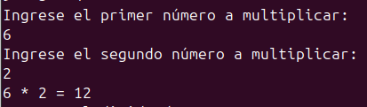

Yeimy Estefania Beltrán Sandoval
# Proposito de la Tarea
El propósito de esta tarea es comprender las operaciones aritméticas básicas en Haskell (suma, resta, multiplicación y división) utilizando únicamente las funciones sucesor y predecesor.
Ademas, se realizo lo mismo pero con números reales.

# Implementación de funciones 

1. Las funciones base de las cuales se derivaron las demas son Sucesor y predecesor

sucesor n = n + 1

predecesor n = n - 1

2. Suma

-Definida de forma recursiva usando la función sucesor.

Ejemplo: suma 5 8 aplica sucesor cinco veces a 8, dando como resultado 13.

3. Resta

- Implementada con la función predecesor.

Ejemplo: resta 5 2 aplica predecesor dos veces a 5, dando 3.

4. Multiplicación

- Definida como suma repetida.

Ejemplo: multi 2 4 calcula 2 + 2 + 2 + 4 = 8.

5. División

- Definida como resta repetida.

- Se resta el divisor del dividendo hasta que el número ya no sea mayor o igual al divisor, contando el número de restas realizadas.

Ejemplo: divi 10 2 → se pueden restar 5 veces, entonces el resultado es 5.

6. Suma de números reales

- Implementada directamente con una función addReal que opera sobre Float.

Ejemplo: addReal 2.5 3.1 = 5.6

# Casos de prueba 

1. Suma

Entrada: suma 4 3

Proceso: aplica el sucesor de 4 tres veces → 5, 6, 7.

Resultado: 7. 

2. Resta

Entrada: resta 9 5

Proceso: aplica el predecesor de 9 cinco veces → 8, 7, 6, 5, 4.

Resultado: 4

3.Multiplicación

Entrada: multi 6 2

Proceso: suma 6 dos veces → 6 + 6.

Resultado: 12

4. División exacta

Entrada: divi 12 4

Proceso: restar 4 a 12 hasta que no se pueda más →
12 - 4 = 8, 8 - 4 = 4, 4 - 4 = 0.
Se realizaron 3 restas.

Resultado: 3

5. División no exacta

Entrada: divi 7 3

Proceso: restar 3 a 7 →
7 - 3 = 4, 4 - 3 = 1.
No se puede restar otra vez porque 1 < 3.
Se realizaron 2 restas.
Resultado: 2

6. Suma de reales (caso 1)

Entrada: addReal 2.5 3.5

Proceso: suma directa de dos Float → 2.5 + 3.5.

Resultado: 6.0

